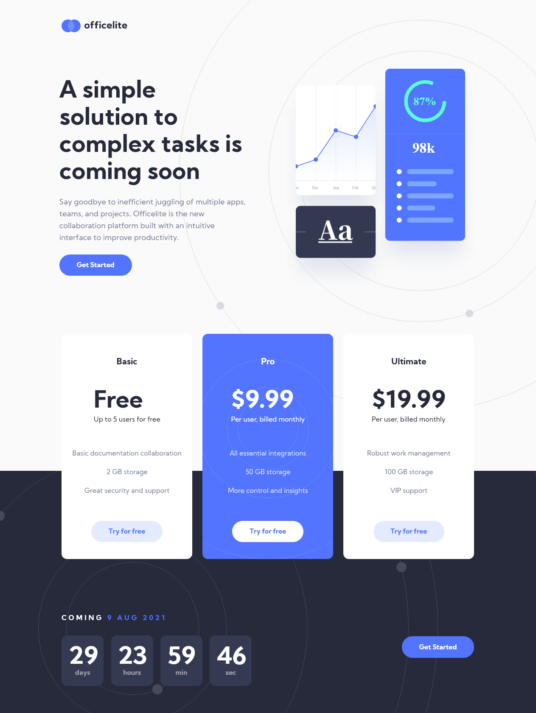

# Frontend Mentor - Officelite coming soon site solution

This is a solution to the [Officelite coming soon site challenge on Frontend Mentor](https://www.frontendmentor.io/challenges/officelite-coming-soon-site-M4DIPNz8g). Frontend Mentor challenges help you improve your coding skills by building realistic projects. 

## Table of contents

- [Overview](#overview)
  - [The challenge](#the-challenge)
  - [Screenshot](#screenshot)
  - [Links](#links)
- [My process](#my-process)
  - [Built with](#built-with)
  - [What I learned](#what-i-learned)
  - [Continued development](#continued-development)
  - [Useful resources](#useful-resources)
- [Author](#author)
- [Acknowledgments](#acknowledgments)

## Overview

### The challenge

Users should be able to:

- View the optimal layout for the site depending on their device's screen size
- See hover states for all interactive elements on the page
- See error states when the contact form is submitted if:
  - The `Name` and/or `Email Address` fields are empty
  - The `Email Address` is not formatted correctly
- **Bonus**: See a live countdown timer that ticks down every second
- **Bonus**: See a custom-styled `select` form control in the sign-up form

### Screenshot

### Links

- Solution URL: [https://www.frontendmentor.io/solutions/officelite-coming-soon-site-with-html-sass-and-vuejs-t9Q7DF_JP](https://www.frontendmentor.io/solutions/officelite-coming-soon-site-with-html-sass-and-vuejs-t9Q7DF_JP)
- Live Site URL: [https://rngueco.github.io/frontend-mentor-projects/officelite-coming-soon-site/](https://rngueco.github.io/frontend-mentor-projects/officelite-coming-soon-site/)

## My process

### Built with

- Semantic HTML5 markup
- CSS custom properties
- Flexbox
- CSS Grid
- Mobile-first workflow
- Sass
- Vue.js

### What I learned

This is the most interesting challenge I've worked on to date. 

It's my first time working with Figma design styles, and at first I didn't know what to look for but after a while I got the hang of it. I did my best trying to replicate every pixel on this design, but I know that's quite impossible to achieve.

It's also my first time working with a frontend framework like Vue.js, so I'm not completely confident with how my components turned out, or even whether or not they should be a Vue component or not. So far with Vue I was able to:
* Build a countdown timer component that takes the end date (release date) and countdown to it from the moment the user opens the page.
+ Build a subscription form component that checks that all required fields are filled out, and that the email address is in a valid format before submitting the form.

As far as styling these components go, I have created a SCSS partial/module for each one of the components I mentioned.

### Continued development

In the future I hope to improve this solution by accomplishing the second bonus challenge: creating a custom `select` form control.

### Useful resources

- [Vue.js Guide and Documentation](https://v3.vuejs.org/guide/introduction.html#what-is-vue-js)

## Author

- Frontend Mentor - [@rngueco](https://www.frontendmentor.io/profile/rngueco)
- Twitter - [@RiyanaGueco](https://www.twitter.com/RiyanaGueco)

## Acknowledgments

Big thanks to Matt and Grace for helping me out with my HTML structure.